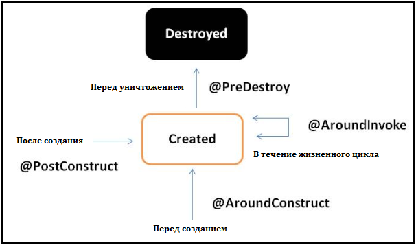

# <a name="Home"></a> CDI - Contexts and Dependency Injection

## Содержание:
- [Вступление](#Intro)
- [Создание проекта](#CreateProject)
- [Bean Archive и включение CDI](#BeanArchive)
- [Контейнер](#Container)
- [CDI бин](#CDIbean)
- [Квалификатор](#Qualifier)
- [Producers](#Producers)
- [Event & Observers](#Observers)
- [Interceptors](#Interceptors)
- [Alternative, Vetoed](#Vetoed)
- [Stereotype](#Stereotype)
- [Delegate](#Delegate)
- [LifeCycle](#LifeCycle)
- [Ресурсы и материалы](#Resources)

## [↑](#Home) <a name="Intro"></a> Вступление
Многие годы программисты писали код, в котором объекты создавались при помощи всем известного ключевого слова **new**. Со временем программы становились всё сложнее и всё сложнее становилось поддерживать витиеватость логики создания, при этом сохраняя гибкость кода к изменениям (естественно, так, чтобы оно не развалилось).
Сначала разрабатывались [паттерны (шаблоны) проектирования](https://refactoring.guru/ru/design-patterns), которые немного улучшили ситуацию. Но хотелось ещё большой лёгкости. И подумали тогда программисты, а почему это мы должны управлять такой рутиной, как создание объектов? Пусть мы будем говорить, где и какой объект мы хотим видеть, а кто-то за нас сделает всю чёрную работу? И тогда придумали термин **Dependency Injection**. То есть класс, от которого мы зависим, назвали "зависимостью"(**Dependency**). И решили назвать его предоставление нам назвать "внедрением"(**Injection**). После этого подумали, что нельзя просто взять и внедрить, смешав все классы в одну большую помойку. И решили разграничить классы на некоторые области, контексты(**Context**), определяющие то, как будут жить эти классы. Ну и да, такие классы, которые живут по CDI правилам, решили называть "CDI бинами"(**CDI beans**).
Ну и чтобы совсем хорошо стало, решили это узаконить.
И придумали спецификацию - **CDI specification**, которая доступна тут: [CDI Specification](http://www.cdi-spec.org/download/).

По теме можно ознакомиться со статьёй на хабре: [Внедрение зависимостей в CDI. Часть 1](https://habr.com/company/at_consulting/blog/301636/). Или прочитать про это в книге ["Изучаем JavaEE7"](https://www.litres.ru/entoni-gonsalves/izuchaem-java-ee-7-2).

## [↑](#Home) <a name="CreateProject"></a> Создание проекта
Для того, чтобы погрузиться в мир магии CDI воспользуемся системой сборки **Gradle** (т.е. для продолжения необходимо [установить его](https://gradle.org/install/)). И любой доступной IDE или даже можно использовать [Sublime Text 3](https://www.sublimetext.com/3).

Итак, для начала нам нужно создать обычный java проект. Самим создавать структуру не обязательно совсем. Поэтому, сделаем это при помощи плагина Gradle: [Gradle Init](https://docs.gradle.org/current/userguide/build_init_plugin.html).
Перейдём в нужный нам каталог и выполним в коммандной строке (в Windows нажать вместе с Shift правой кнопкой мыши на свободном месте и выбрать "Открыть окно комманд"):
```
gradle init --type java-application
```
Дожидаемся надписи **BUILD SUCCESSFUL** и открываем проект в вашей любимой IDE.
Или, например, в Sublime Text 3 можем открыть через **File → Open Folder**, выбрав каталог, в котором была выполнена комманда **gradle init**.
Для начала, откроем **build script** - файлик **build.gradle**.
Мы хотим при помощи аннотаций управлять тем, каким образом будет работать CDI. CDI - это часть стандарта JEE. Поэтому, нам нужно указать в проекте, что мы хотим использовать JEE аннотации. Как это сделать, мы можем подсмотреть на [Maven Central](https://search.maven.org/#artifactdetails%7Cjavax%7Cjavaee-api%7C8.0%7Cjar):
```xml
// JEE specifications
compile 'javax:javaee-api:8.0'
```
Спецификации лишь указывают, как должно работать там, где заявлена поддержка JEE стека технологий. Реализацую же каждый может выбрать свою. Одна из самых популярных реализаций - [**Weld**](http://weld.cdi-spec.org/). Например, именно **Weld** используется в сервере приложений **WildFly**.
Следовательно, подключим зависимость от weld - [**weld-se-core**](https://mvnrepository.com/artifact/org.jboss.weld.se/weld-se-core/3.0.4.Final):
```xml
// CDI implementation
compile 'org.jboss.weld.se:weld-se-core:3.0.4.Final'
```
Ну и для начала создадим некоторую предварительную модель.
Создадим в каталоге **src/main/java** (в так называемом **Source Dir**) новые подкаталоги для пакетов и назовём их **model** и **service**.

У продуктов может быть некоторый "код продукта":
```java
import java.util.Random;

public class ProductCode {
    private final int rnd = new Random().nextInt(100);

    public String getValue() {
        return String.valueOf(rnd);
    }
}
```
Есть сам продукт:
```java
public class Product {

    private ProductCode code;

    public Product(ProductCode code) {
        this.code = code;
    }

    public ProductCode getCode() {
        return this.code;
    }
}
```
Есть сервис:
```java
public class ProductService {

    public Product getProduct() {
        return new Product(new ProductCode());
    }
}
```
И добавим небольшой тест в AppTest.java:
```java
@Test
public void shouldCreateProductWithCode() {
	ProductService service = new ProductService();
	Product product = service.getProduct();
	assertTrue(product.getCode().getValue() != null);
}
```
В build.gradle так же можно добавить для красоты:
```xml
test {
    testLogging {
        events "standardOut", "passed", "skipped", "failed"
    }
}
```
Это позволит нам увидеть, какие тесты выполнились.
Выполняем: ```gradle cleanTest test``` и видим, что проект готов.

## [↑](#Home) <a name="BeanArchive"></a> Bean Archive и включение CDI
Чтобы механизм CDI включился, необходимо чтобы был подготовлен **Bean Archive** с CDI бинами, о чём указано в спецификации: ["12.1. Bean archives"](http://docs.jboss.org/cdi/spec/2.0/cdi-spec.html#bean_archive).
Bean архивом называется такой артефакт, внутри которого есть файл **beans.xml** (т.е. буквально - бины.xml).
Он должен находиться в **META-INF/beans.xml** (т.е. быть на Class Path проекта. Например, в каталоге resources). Подробнее описано в специфкиации: "[**12.1. Bean archives**](http://docs.jboss.org/cdi/spec/2.0/cdi-spec.html#bean_archive)".
Создадим в **src/main** каталог **resources/META-INF**. А внутри создадим файл **beans.xml**.
Справедливый вопрос: как же понять, как он должен выглядеть. Конечно же, узнаем это из спецификации: [**CDI 2.0 Specification - HTML Version**](http://docs.jboss.org/cdi/spec/2.0/cdi-spec.html):
```xml
<?xml version="1.0" encoding="UTF-8"?>
<beans xmlns="http://xmlns.jcp.org/xml/ns/javaee"
       xmlns:xsi="http://www.w3.org/2001/XMLSchema-instance"
       xsi:schemaLocation="http://xmlns.jcp.org/xml/ns/javaee http://xmlns.jcp.org/xml/ns/javaee/beans_2_0.xsd" bean-discovery-mode="all" version="2.0">

</beans>
```
Тут важно, что ```bean-discovery-mode="all"```. По умолчанию используется тип - ["**2.5. Default bean discovery mode**"](http://docs.jboss.org/cdi/spec/2.0/cdi-spec.html#default_bean_discovery).

## [↑](#Home) <a name="Container"></a> Container
Итак, билд проходит успешно. Механизм CDI включен. Теперь надо как-то заставить это всё работать.
Как мы говорили выше, если бин является CDI бином, то им должен управлять кто-то, но не мы. То есть CDI бин управляемый, он **Managed CDI Bean**. А самим управленцем является **CDI Container**. В JEE окружении (когда у нас есть запущенный сервер приложений, который реализует JEE спецификации, такой как WildFly) нам предоставляют CDI контейнер. Когда мы запускаем обычный main метод или выполняем JUnit тест, то мы в SE окружении и инициализация CDI контейнера в наших руках. Подробнее можно прочитать здесь: [13. Bootstrapping a CDI container in Java SE](http://docs.jboss.org/cdi/spec/2.0/cdi-spec.html#se_bootstrap). Чтобы понять, как вся эта магия работает, лучше сначала побаловаться из SE окружения и прочувствовать всю магию )

Добавим нужные импорты в AppTest.java. Они указаны в главе [13.2. SeContainer interface](http://docs.jboss.org/cdi/spec/2.0/cdi-spec.html#se_container):

```java
import javax.enterprise.inject.se.SeContainer;
import javax.enterprise.inject.se.SeContainerInitializer;
```
Добавим к нашим тестам методы JUnit, которые будут стартовать контейнер:
```java
private SeContainerInitializer containerInit;
private SeContainer container;

@Before
public void before() {
	containerInit = SeContainerInitializer.newInstance();
	container = containerInit.initialize();
}

@After
public void after() {
	container.close();
}
```
Ну и изменим сам тест:

```java
@Test
public void shouldCreateProductWithCode() {
	ProductService service = container.select(ProductService.class).get();
	Product product = service.getProduct();
	assertTrue(product.getCode().getValue() != null);
}
```
Но если мы сейчас выполним ```gradle cleanTest test```, то с грустью увидим, что... ничего не работает - ```WELD-ENV-002009: Weld SE container cannot be initialized - no bean archives found```.
Оказывается, у Gradle есть особенность: [Bean discovery problems when using weld-se with Gradle application plugin](https://stackoverflow.com/questions/30255760/bean-discovery-problems-when-using-weld-se-with-gradle-application-plugin). Поэтому, необходимо в **build.gradle** добавить в конец:
```xml
task copyBeansFileTask(type: Copy) {
    from "${projectDir}/src/main/resources"
    into "${buildDir}/classes/main"
}
test.dependsOn copyBeansFileTask
```

Теперь, если всё правильно, мы можем выполнить ```gradle cleanTest test```.
А что самое приятное, мы можем открыть отчёт о тесте. Например для Windows:
```
explorer build\reports\tests\test\index.html
```
Это откроет в браузере по умолчанию отчёт. И мы даже можем увидеть Standart Output там!

## [↑](#Home) <a name="CDIbean"></a> CDI бин
Итак, чтобы классом смог управлять CDI контейнер, этот класс должен быть **Maneged CDI bean** - [**3.1.1. Which Java classes are managed beans?**](http://docs.jboss.org/cdi/spec/2.0/cdi-spec.html#what_classes_are_beans). Если условия соблюдены - класс будет являться CDI бином.

Мы раньше уже использовали ProductService как CDI бин. Это было сделано потому, что только в CDI бинах работает CDI магия. Теперь можем сделать чуть больше магии.
Например, код продукта опишем интерфейсом:
```java
public interface ProductCode {
    String getValue();
}
```
И создадим для него реализацию:
```java
public class DigitCode implements ProductCode {

    private final int rnd = new Random().nextInt(100);

    public String getValue() {
        return String.valueOf(rnd);
    }

}
```
Изменим теперь сервис, добавив туда CDI магии:
```java
public class ProductService {

    @Inject
    private ProductCode code;

    public Product getProduct() {
        return new Product(code);
    }
}
```
Как мы видим, мы сами не создаём code. За нас его создаст CDI контейнер. Причём тогда, когда это понадобится, то есть в момент создадия нового продукта!

Мы так же можем создавать каждый раз - новый ProductCode:
```java
@Inject
private Instance<ProductCode> instance;

public Product getProduct() {
	return new Product(instance.get());
}
```
Всё хорошо, но тут есть подводные камни при реальном использовании. Подробнее см. ["DON’T GET TRAPPED INTO A MEMORY LEAK USING CDI INSTANCE INJECTION"](https://blog.akquinet.de/2017/01/04/dont-get-trapped-into-a-memory-leak-using-cdi-instance-injection/).

## [↑](#Home) <a name="Qualifier"></a> Квалификатор
Добавим новую реализацию:
```java
public class LiteralCode implements ProductCode {

    @Override
    public String getValue() {
        StringBuilder sb = new StringBuilder(5);
        for (int i = 0; i < sb.capacity(); i++) {
            sb.append((char)(new Random().nextInt(25) + 65));
        }
        return sb.toString();
    }
}
```
И тут мы получим ошибку:
> WELD-001409: Ambiguous dependencies for type ProductCode with qualifiers @Default
  Possible dependencies:
  - Managed Bean [class model.LiteralCode] with qualifiers [@Any @Default],
  - Managed Bean [class model.DigitCode] with qualifiers [@Any @Default]

Это произошло потому, что мы просим вставить ProductCode, а реализаций уже несколько. Какую нужно выбрать? Он не может догадаться сам. Поэтому, мы должны использовать квалификатор.
Создадим для квалификаторо отдельный пакет **src/main/java/qualifiers**.
Создадим квалификатор, описывающий тип кода:
```java
@Target({ElementType.TYPE, ElementType.FIELD})
@Retention(RetentionPolicy.RUNTIME)
@Qualifier
public @interface CodeType {
    CodeType.Type type();

    enum Type {
        DIGIT, LITERAL
    }
}
```
Теперь, каждую реализацию ProductCode тоже опишем:
```java
@CodeType(type = CodeType.Type.DIGIT)
public class DigitCode implements ProductCode {
```
и
```java
@CodeType(type = CodeType.Type.LITERAL)
public class LiteralCode implements ProductCode {
```
Ну а в нашем сервисе укажем, какую из этих реализаций мы хотим использовать:
```java
@Inject
@CodeType(type = CodeType.Type.LITERAL)
private ProductCode code;
```

## [↑](#Home) <a name="Producers"></a> Producers
В CDI есть очень полезный механизм - продюсирование. Данному механизму отведён отдельный раздел ["Chapter 8. Producer methods"](http://docs.jboss.org/weld/reference/latest-master/en-US/html_single/#producer_methods).
Пример можно увидеть также здесь: [Java EE CDI Producer methods tutorial](http://www.byteslounge.com/tutorials/java-ee-cdi-producer-methods-tutorial)

Это может быть полезно тогда, когда то, Inject чего мы хотим сделать имеет сложные правила (например, в зависимости от окружающих условий возвращать разные реализации) или когда мы хотим вернуть что-то, что не является CDI Bean'ом.

Например, в моделе у нас есть абстрактный класс для хранения продуктов:
```java
// CDI bean can't be abstract
public abstract class ProductBox {

    public abstract List<Product> getProducts();
}
```

Создадим пакет **src/main/java/producers** и создадим там класс:
```java
public class ProductBoxProducer {

    @Produces
    public ProductBox newProductBox(InjectionPoint injectionPoint) {
        return new ProductBox() {
            private List<Product> products = new ArrayList<>();
            @Override
            public List<Product> getProducts() {
                return products;
            }
        };
    }
}
```
Интересно, что мы можем входным параметром указать **InjectionPoint**. Это "точка внедрения" - то место, куда будет выполнено внедрён новый объект.
Отсюда можно получить много интересных метаданных. Подробнее см. ["JEE API : Injection Point"](https://javaee.github.io/javaee-spec/javadocs/javax/enterprise/inject/spi/InjectionPoint.html).

И теперь изменим наш ProductService:
```java
@Inject @CodeType(type = CodeType.Type.DIGIT)
private ProductCode code;

@Inject
private ProductBox productBox;

public Product getProduct() {
	Product product = new Product(code);
	productBox.getProducts().add(product);
	return product;
}

public ProductBox getProductBox() {
	return productBox;
}
```
Можно теперь добавить новый тест:
```java
@Test
public void shouldAddProductToTheBox() {
	ProductService service = container.select(ProductService.class).get();
	Product product = service.getProduct();
	ProductBox productBox = service.getProductBox();
	assertEquals(product, productBox.getProducts().get(0));
}
```

Кроме того, мы можем сказать, как нужно закрыть/уничтожить то, что сделал продюсер. При помощи аннотации **@Disposes** у параметра метода (Dispose в переводе с англ - "Избавиться"):
```java
public void clearBox(@Disposes ProductBox box) {
	box.getProducts().clear();
}
```
В данном случае пример несколько синтетический, но механизм использования показывает. Данный метод будет вызван тогда, когда контекст, к которому привязан бин, будет иничтожаться. А следовательно, нужно избавиться и от всех бинов.

## [↑](#Home) <a name="Observers"></a> Event & Observers
CDI - мощный механизм, работа которого не ограничивается просто внедрением объектов. Одной из функций CDI является события и обозреватели этих событий. Данная возможность описана тут: ["CDI Specification : 10. Events"](http://docs.jboss.org/cdi/spec/2.0/cdi-spec.html#events).
Например, мы хотим создавать событие на создание каждого продукта.
Создадим пакет **src/main/java/events** и в нём класс события:
```java
public class ProductCreationEvent {
    private ProductCode code;

    public ProductCreationEvent(ProductCode code) {
        this.code = code;
    }

    public ProductCode getCode() {
        return code;
    }
}
```
Теперь, нужен наблюдатель за этим событием:
```java
public class ProductCreationObserver {

    @Inject
    private Event<ProductCreationEvent> event;

    public void observe(ProductCreationEvent logEvent) {
        event.fire(logEvent);
    }
}
```
И теперь нужен слушатель:
```java
public class ProductCreationListener {
    public void logEvent(@Observes ProductCreationEvent event){
        System.out.println("Created: " + event.getCode().getValue());
    }
}
```
Теперь в нашем сервисе по созданию продуктов добавим инжект обсервера:
```java
@Inject
private ProductCreationObserver observer;
```
И в метод создания продукта добавляем:
```java
observer.observe(new ProductCreationEvent(product.getCode()));
```
То есть мы сообщаем observer'у новое событие (создаём его).
Observer возбуждает новый **CDI Event** (Event<> event), типизированный нашим событием.
А Listener, у которого в методе наше событие аннотировано @Observes слушает, когда будет создано CDI Event.

Тут важно знать, что события можно обрабатывать в одном потоке и в нескольких. Для асинхронной обработки служит метод **Event.fireAsync** и аннотация **@ObservesAsync**. Например, если все события выполняются в разных потоках, то если 1 поток упадёт с Exception, то остальные смогут выполнить свою работу.

## [↑](#Home) <a name="Interceptors"></a> CDI interceptors
CDI предоставляет возможность использования интерцепторов. Подробнее описано в разделе спецификации: ["9. Interceptor bindings"](http://docs.jboss.org/cdi/spec/2.0/cdi-spec.html#interceptors).
На основе примера из спецификации сделаем так же. Вот сам пример: [1.3.6. Interceptor example](http://docs.jboss.org/cdi/spec/2.0/cdi-spec.html#_interceptor_example).
Создадим отдельный пакет - **interceptors** и в нём нужные классы:
```java
@Inherited
@InterceptorBinding
@Target({TYPE, METHOD})
@Retention(RUNTIME)
public @interface ProductionLog {
}
```
Эта аннотация будет привязывать (биндить, выполнять bind) интерцептора к CDI бину.
В ProductService аннотируем метод новой аннотацией:
```java
@ProductionLog
public Product getProduct() {
```
И теперь опишем сам интерцептор:
```java
@ProductionLog
@Interceptor
public class ProductLogInterceptor {

    @AroundInvoke
    public Object log(InvocationContext ic) throws Exception {
        System.out.println("Invocation method: " + ic.getMethod().getName());
        return ic.proceed();
    }
}
```
Но тут есть нюанс. По умолчанию, все интерцепторы отключены и их надо включить. В том самом файлике **beans.xml**. Для этого нужно добавить блок interceptors. Например:
```xml
<interceptors>
	<class>interceptors.ProductLogInterceptor</class>
</interceptors>
```
Теперь интерцептор включиться и каждый вызов метода, аннотированного через
@ProductionLog, будет проходить через интерцептор. Вот такая вот CDI Magic )

Помимо ```@AroundInvoke``` есть ещё ```@AroundConstruct```, которая добавляет интерпцептор для конструктора бинов.

## [↑](#Home) <a name="Vetoed"></a> Alternative, Vetoed
В CDI есть возможность управлять тем, какие бины стоит учитывать CDI контейнеру, а какие - нет.
Одной из таких возможностей является использование Alternative, что описано в спецификации в разделе ["2.7. Alternatives"](http://docs.jboss.org/cdi/spec/2.0/cdi-spec.html#alternatives).
Нужный CDI бин помечается аннотацией ```@Alternative```.
Далее, когда данную альтернативу нужно задействовать, то её надо объявить в **beans.xml**, как это указано в спецификации: [5.1.1.2. Declaring selected alternatives for a bean archive](http://docs.jboss.org/cdi/spec/2.0/cdi-spec.html#declaring_selected_alternatives_bean_archive).

Если класс аннотирован ```@Vetoed```, то он перестаёт являться CDI бином. Аналогично, можно пометить целый пакет как @Vetoed. Пакет помечается в **package-info.java**.

## [↑](#Home) <a name="Stereotype"></a> Stereotype
CDI имеет такое понятие, как Stereotpe. Они описаны в спецификации в разделе ["2.8. Stereotypes"](http://docs.jboss.org/cdi/spec/2.0/cdi-spec.html#stereotypes).
Мы можем указать некоторую аннотацию, аннотированную ```@Stereotype``` и сгруппировать в ней нужные нам особенности, такие как Scope бина, квалификаторы, интерцепторы и прочее.

## [↑](#Home) <a name="Delegate"></a> Delegate
Механизм делегирования в CDI описан в разделе спецификации ["8. Decorators"](http://docs.jboss.org/cdi/spec/2.0/cdi-spec.html#decorators).
А так же в спецификации указан пример: ["1.3.7. Decorator example"](http://docs.jboss.org/cdi/spec/2.0/cdi-spec.html#_decorator_example).

Подробнее описано так же здесь: [Weld - Chapter 10. Decorators](https://docs.jboss.org/weld/reference/latest/en-US/html/decorators.html).

## [↑](#Home) <a name="LifeCycle"></a> Жизненный цикл
Так как CDI бин управляется CDI контейнером, у него есть некоторый определённый жизненный цикл.

Картинку взял из статьи, которая очень понравилась: [Java EE Interceptors](https://abhirockzz.wordpress.com/2015/01/03/java-ee-interceptors/).

CDI Managed Beans являются contextual, то есть их жизненный цикл зависит от контекста и их жизненным циклом управляет контейнер. Говоря о жизненным цикле необходимо прочитать раздел спецификации: ["7. Lifecycle of contextual instances"](http://docs.jboss.org/cdi/spec/2.0/cdi-spec.html#lifecycle).

Итак, по картинке видно, что у бина есть так называемые **lifecycle call backs**: **@PostConstruct** и **@PreDestroy**.

Так же стоит знать, что есть жизненный цикл и у самого контейнера: [Container lifecycle events](https://docs.jboss.org/cdi/spec/2.0/cdi-spec.html#init_events).

## [↑](#Home) <a name="Resources"></a> Ресурсы и материалы
Дополнительно к ознакомлению:
- [CDI 2.0 specifiaction](http://docs.jboss.org/cdi/spec/2.0/cdi-spec.html)
- [Weld JUnit тесты](https://github.com/weld/weld-junit)
- Обзор ["Weld + JUnit = Easy Testing of CDI Beans"](https://dzone.com/articles/weld-junit-easy-testing-of-cdi-beans)
- JTA и CDI: [3.7 Transactional Annotation](http://download.oracle.com/otn-pub/jcp/jta-1_2-mrel2-eval-spec/JTA1.2Specification.pdf)
- Литрес: ["Изучаем Java EE 7"](https://www.litres.ru/entoni-gonsalves/izuchaem-java-ee-7-2)